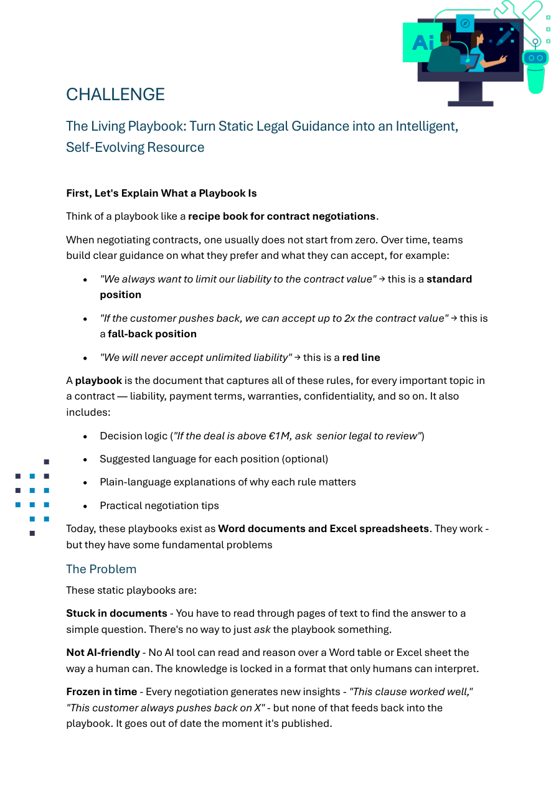
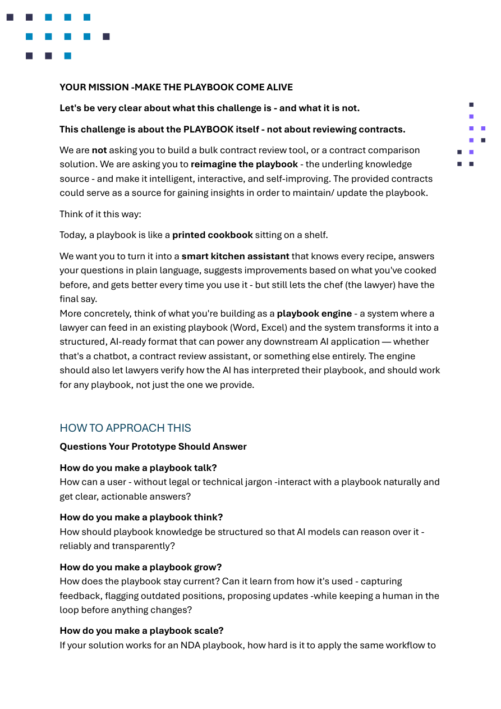
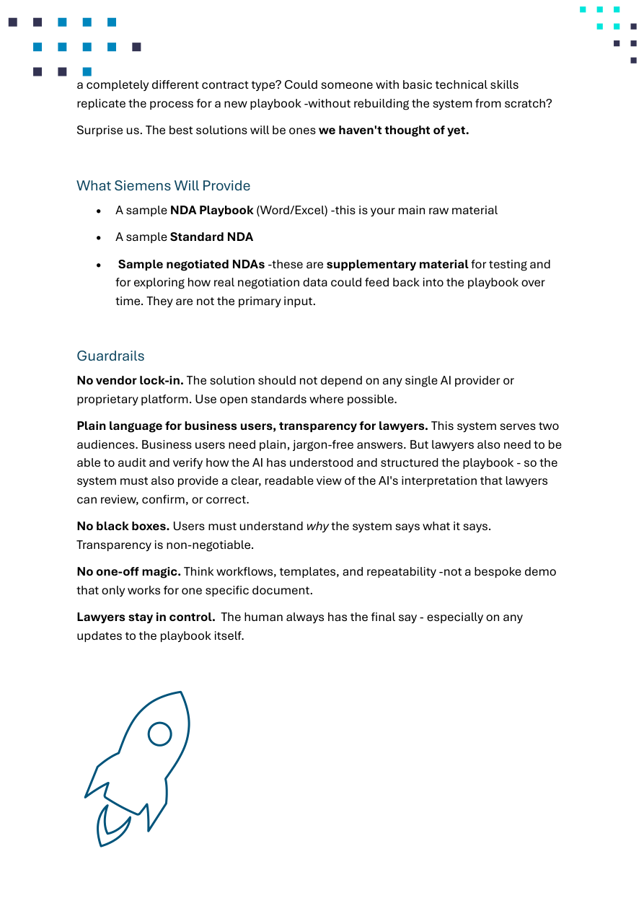

<div align="center">

# Lou


**Munich Hacking Legal 2026 — Siemens AG Challenge**

</div>

---

## Team

| Name | Roles |
|------|-------|
| C. Oflazoglu |   |
| M. Becevova |   |
| N. N. Müller |   |
| J. Urgun |   |

> Role colors:  Orange &nbsp;·&nbsp;  Green &nbsp;·&nbsp;  Blue

---

## The Challenge

**Core ask:** Turn a static Word/Excel negotiation playbook into an intelligent, self-updating system — not a contract review tool.

| Problem | What we need to solve |
|---------|----------------------|
| Playbooks live in Word/Excel | Make them queryable in plain language |
| AI can't reason over tables | Structure rules into machine-readable format |
| Knowledge goes stale | Feedback loop: outcomes → playbook updates (lawyer approves) |
| One-off solutions don't scale | Works for ANY contract type, not just NDAs |

**Four questions to answer:**
1. **Talk** — how does a non-lawyer interact with the playbook naturally?
2. **Think** — how is knowledge structured so AI can reason over it reliably?
3. **Grow** — how does it stay current? Human in the loop for every update.
4. **Scale** — replicate for a new contract type without rebuilding?

**Guardrails (non-negotiable):**
- No vendor lock-in (no single AI provider dependency)
- No black boxes — every answer cites its source
- Lawyers always approve updates — nothing auto-applies
- Plain language for business, audit view for lawyers

**What Siemens provides:**
- Sample NDA Playbook (Word/Excel) — primary input
- Sample Standard NDA
- Sample negotiated NDAs — supplementary (testing, feedback loop)

---

## Challenge Brief — Full Pages

### Page 1


### Page 2


### Page 3


---

## Key Concepts

### What is a Playbook?

A playbook = recipe book for contract negotiations. Contains:

| Rule type | Example |
|-----------|---------|
| Standard position | "Limit liability to contract value" |
| Fallback position | "Accept up to 2× contract value if customer pushes" |
| Red line | "Never accept unlimited liability" |
| Decision logic | "If deal > €1M, escalate to senior legal" |
| Suggested language | Pre-written clause text |
| Plain-language reasoning | Why each rule exists |

### What we're building — Playbook Engine

```
Input:   Word/Excel playbook
          ↓
Layer 1: Parser → extracts rules into structured format (standard / fallback / red line)
          ↓
Layer 2: Query interface → plain language Q&A with source citations
          ↓
Layer 3: Feedback loop → negotiation outcomes → proposed updates → lawyer approval
```

- Every answer cites which rule it came from
- Lawyer reviews AI interpretation before going live
- No playbook update without explicit sign-off
- Works for any playbook type (NDA, MSA, etc.)

---

## Notes / Scratchpad

> Add running notes here during the hackathon

- 

---

## Event

### Schedule

| Time | Saturday Apr 25 |
|------|----------------|
| 09:00–10:00 | Arrival & registration |
| 10:00–10:30 | Opening session |
| 10:30–11:45 | Challenge presentations + team matching |
| **11:35** | **Challenge registration deadline** |
| **12:00** | **Hacking starts** |
| 12:15 | Tech workshops: Lovable (R2300), OpenAI (R2370) |
| 13:00 | Lunch |
| 14:00 | Tech workshop: Google Cloud (R2370) |
| 19:00 | Dinner |
| 23:00 | Midnight snacks |

| Time | Sunday Apr 26 |
|------|--------------|
| 08:00–09:00 | Breakfast |
| 09:00–12:00 | Hacking continues |
| **12:00** | **Submission deadline** |
| 13:00–14:00 | Semi-finals (4 tracks, 2 finalists each) |
| **14:00** | **Grand Final** — Main Lecture Hall |
| 15:30–16:00 | Awards ceremony |

### WiFi

| Network | Credentials | Notes |
|---------|------------|-------|
| `mwn-events` (LRZ) | User: `muni-2026425` / PW: `xuf5thfM` | **Recommended** — paid/donated, valid Apr 22–26 |
| `@BayernWLAN` | No login needed, accept terms | Free public, unencrypted — use VPN |
| `eduroam` | Your institutional login | Encrypted, set up before arriving |

---

## Resources

- [Siemens Challenge on GitHub](https://github.com/Liquid-Legal-Institute/munich-hacking-legal-2026/tree/main/challenges/siemens)
- [Munich Hacking Legal 2026](https://github.com/Liquid-Legal-Institute/munich-hacking-legal-2026)
- [Challenge brief PDF](./siemens-challenge-brief.pdf)
